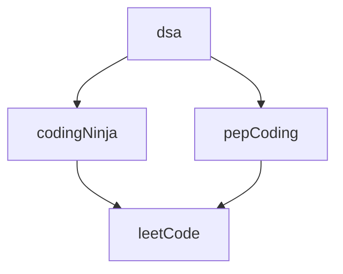

### 105 Day Java From March 2022

# CodingNinja's

CodingNinja's

	

    
  

	
	

#### Problems

  1. <a href="https://raw.githubusercontent.com/DHIMANvivek/105-Days-From-Now/master/returnArraySum.png" class="button primary">Return Array Sum</a> | <a href="https://raw.githubusercontent.com/DHIMANvivek/105-Days-From-Now/master/Coding_Ninja/src/Return_Array_Sum.java" class="button primary">Sol</a>
  
  2. <a href="https://raw.githubusercontent.com/DHIMANvivek/105-Days-From-Now/master/Coding_Ninja/src/linear%20search.png" class="button primary">Linear Search</a> | <a href="https://raw.githubusercontent.com/DHIMANvivek/105-Days-From-Now/master/Coding_Ninja/src/linear_Search.java" class="button primary">Sol</a>
	
  3. <a href="https://www.codingninjas.com/codestudio/guided-paths/data-structures-algorithms/content/118820/offering/1381870?leftPanelTab=0" class="button primary">Maximum Subarray Sum [Kadane's Algorithm]</a> | <a href="https://raw.githubusercontent.com/DHIMANvivek/105-Days-From-Now/master/Coding_Ninja/src/Maximum_Subarray_Sum.java" class="button primary">Sol</a>

  4. <a href="https://raw.githubusercontent.com/DHIMANvivek/105-Days-From-Now/master/Coding_Ninja/src/Arrange_Numbers_In_Arrays.png" class="button primary">Arrange Numbers in Array</a> | <a href="https://raw.githubusercontent.com/DHIMANvivek/105-Days-From-Now/master/Coding_Ninja/src/Arrange_Numbers_In_Array.java" class="button primary">Sol</a>
	
  5. <a href="https://raw.githubusercontent.com/DHIMANvivek/105-Days-From-Now/master/Coding_Ninja/src/Swap_Alternate.jpg" class="button primary">Swap Alternate</a> | <a href="https://raw.githubusercontent.com/DHIMANvivek/105-Days-From-Now/master/Coding_Ninja/src/Swap_Alternate.java" class="button primary">Sol</a>
	
  6. <a href="https://www.codingninjas.com/codestudio/problems/two-sum_839653?topList=mohammad-fraz-beginner-dsa-sheet-problems&leftPanelTab=0" class="button primary">Two Sum With ArrayList</a> | <a href="https://raw.githubusercontent.com/DHIMANvivek/105-Days-From-Now/master/Coding_Ninja/src/Two_Sum_Array_List.java" class="button primary">Sol</a>
	
  7. <a href="https://raw.githubusercontent.com/DHIMANvivek/105-Days-From-Now/master/Coding_Ninja/src/Target_Contest.jpg" class="button primary">Trade</a> | <a href="https://raw.githubusercontent.com/DHIMANvivek/105-Days-From-Now/master/Coding_Ninja/src/target_Trade.java" class="button primary">Sol</a>
	
  8. <a href="https://raw.githubusercontent.com/DHIMANvivek/105-Days-From-Now/master/Coding_Ninja/src/Find_Unique.jpg" class="button primary">Find Unique</a> | <a href="https://raw.githubusercontent.com/DHIMANvivek/105-Days-From-Now/master/Coding_Ninja/src/Find_Unique.java" class="button primary">Sol</a>
	
  9. <a href="https://raw.githubusercontent.com/DHIMANvivek/105-Days-From-Now/master/Coding_Ninja/src/Array_Intersection.jpg" class="button primary">Array Intersection</a> | <a href="https://raw.githubusercontent.com/DHIMANvivek/105-Days-From-Now/master/Coding_Ninja/src/Array_Intersection.java" class="button primary">Sol</a>
	
  10. <a href="https://raw.githubusercontent.com/DHIMANvivek/105-Days-From-Now/master/Coding_Ninja/src/Triplet_Sum.jpg" class="button primary">Triplet Sum</a> | <a href="https://raw.githubusercontent.com/DHIMANvivek/105-Days-From-Now/master/Coding_Ninja/src/Triplet_Sum.java" class="button primary">Sol</a>
	
  11. <a href="https://www.codingninjas.com/codestudio/problems/631055?topList=striver-sde-sheet-problems&utm_source=striver&utm_medium=website&leftPanelTab=0" class="button primary">Sort 0's 1's 2's</a> | <a href="https://raw.githubusercontent.com/DHIMANvivek/105-Days-From-Now/master/Coding_Ninja/src/Sort-0-1-2.java" class="button primary">Sol</a>
	
  12. <a href="https://raw.githubusercontent.com/DHIMANvivek/105-Days-From-Now/master/Coding_Ninja/src/binary_search.jpg" class="button primary">Binary Search</a> | <a href="https://raw.githubusercontent.com/DHIMANvivek/105-Days-From-Now/master/Coding_Ninja/src/Binary_Search.java" class="button primary">Sol</a>
	
  13. <a href="https://raw.githubusercontent.com/DHIMANvivek/105-Days-From-Now/master/Coding_Ninja/src/SelectionSort.jpg" class="button primary">Selection Sort</a> | <a href="https://raw.githubusercontent.com/DHIMANvivek/105-Days-From-Now/master/Coding_Ninja/src/Selection_Sort.java" class="button primary">Sol</a>
	
  14. <a href="https://raw.githubusercontent.com/DHIMANvivek/105-Days-From-Now/master/Coding_Ninja/src/Bubble_Sort.jpg" class="button primary">Code Bubble Sort</a> | <a href="https://raw.githubusercontent.com/DHIMANvivek/105-Days-From-Now/master/Coding_Ninja/src/Bubble_Sort.java" class="button primary">Sol</a>
	
  15. <a href="https://www.codingninjas.com/codestudio/problems/stocks-are-profitable_893405?topList=mohammad-fraz-beginner-dsa-sheet-problems" class="button primary">Stocks are profitable ArrayList</a> | <a href="https://raw.githubusercontent.com/DHIMANvivek/105-Days-From-Now/master/Coding_Ninja/src/stocks_ArrayList.java" class="button primary">Sol</a> | ★
	
  16. <a href="" class="button primary">Code Merge Two Sorted Arrays</a> | <a href="https://raw.githubusercontent.com/DHIMANvivek/105-Days-From-Now/master/Coding_Ninja/src/mergeTwoSortedArray.java" class="button primary">Sol</a>
 

# PepCoding

PepCoding

	

    
  

	
	

#### Problems

  1.  <a href="https://www.pepcoding.com/resources/online-java-foundation/patterns/pattern-type-1-official/ojquestion" class="button primary">Pattern 1</a> | <a href="https://raw.githubusercontent.com/DHIMANvivek/105-Days-From-Now/master/pepCoding/Pattern1.java" class="button primary">Sol</a>
	
  2.  <a href="https://www.pepcoding.com/resources/online-java-foundation/patterns/pattern-type-2-official/ojquestion" class="button primary">Pattern 2</a> | <a href="https://raw.githubusercontent.com/DHIMANvivek/105-Days-From-Now/master/pepCoding/pattern2.java" class="button primary">Sol</a>
	
  3.  <a href="https://www.pepcoding.com/resources/online-java-foundation/patterns/pattern-type-3-official/ojquestion" class="button primary">Pattern 3</a> | <a href="https://raw.githubusercontent.com/DHIMANvivek/105-Days-From-Now/master/pepCoding/pattern3.java" class="button primary">Sol</a>
	
  4.  <a href="https://www.pepcoding.com/resources/online-java-foundation/function-and-arrays/digit-frequency-official/ojquestion" class="button primary">Digit Frequency</a> | <a href="https://raw.githubusercontent.com/DHIMANvivek/105-Days-From-Now/master/pepCoding/Digit_Frequency.java" class="button primary">Sol</a>
	
  5.  <a href="https://www.pepcoding.com/resources/online-java-foundation/function-and-arrays/decimal-to-any-base-official/ojquestion" class="button primary">Decimal To Any Base</a> | <a href="https://raw.githubusercontent.com/DHIMANvivek/105-Days-From-Now/master/pepCoding/Decimal_To_Any_Base.java" class="button primary">Sol</a>
	
  6.  <a href="https://www.pepcoding.com/resources/online-java-foundation/function-and-arrays/any-base-to-decimal-official/ojquestion#" class="button primary">Any Base To Decimal</a> | <a href="https://raw.githubusercontent.com/DHIMANvivek/105-Days-From-Now/master/pepCoding/AnyBASE_To_Decimal.java" class="button primary">Sol</a>
	
  7.  <a href="https://www.pepcoding.com/resources/online-java-foundation/function-and-arrays/any-base-to-any-base-official/ojquestion" class="button primary">Any Base To Any Base</a> | <a href="https://raw.githubusercontent.com/DHIMANvivek/105-Days-From-Now/master/pepCoding/AnyBaseToAnyBase.java" class="button primary">Sol</a>
	
	
	

# LeetCode

LeetCode

	

    
  

	
	

#### Problems

  1. <a href="https://leetcode.com/problems/set-matrix-zeroes/" class="button primary">Set Matrix Zeroes</a> | <a href="https://raw.githubusercontent.com/DHIMANvivek/105-Days-From-Now/master/leetCode/src/leetCode/Set_Matrix_Zeroes.java" class="button primary">Sol</a>
	
	
  2. <a href="https://leetcode.com/problems/pascals-triangle/submissions/" class="button primary">Pascal's Triangle</a> | <a href="https://raw.githubusercontent.com/DHIMANvivek/105-Days-From-Now/master/leetCode/src/leetCode/pascal_Triangle.java" class="button primary">Sol</a> | <a href="https://www.youtube.com/watch?v=icoql2WKmbA" class="button primary">Video</a> | ★
	
  3. <a href="https://leetcode.com/problems/next-permutation/" class="button primary">Next Permutation</a> | <a href="https://raw.githubusercontent.com/DHIMANvivek/105-Days-From-Now/master/leetCode/src/leetCode/Next_Permutation.java" class="button primary">Sol</a> | <a href="https://www.youtube.com/watch?v=x3B8_J-g7HE" class="button primary">Video</a>  | ★ ★ 
	
  4. <a href="https://leetcode.com/problems/maximum-subarray/" class="button primary">Kadan's Algorithm</a> | <a href="https://leetcode.com/submissions/detail/658416242/" class="button primary">Sol</a>
	
  5. <a href="https://leetcode.com/problems/sort-colors/" class="button primary">Dutch National Flag (DNF) Sort</a> | <a href="https://leetcode.com/submissions/detail/658525991/" class="button primary">Sol</a>
	
  6. <a href="https://leetcode.com/problems/best-time-to-buy-and-sell-stock/" class="button primary">Best Time to Buy and Sell Stock</a> | <a href="https://leetcode.com/submissions/detail/659162846/" class="button primary">Sol</a>
	
  7. <a href="https://leetcode.com/problems/rotate-image/" class="button primary">Rotate Image</a> | <a href="https://leetcode.com/submissions/detail/659872584/" class="button primary">Sol</a>
	
  8. <a href="https://leetcode.com/problems/merge-intervals/submissions/" class="button primary">Merge Intervals</a> | <a href="https://leetcode.com/submissions/detail/660607040/" class="button primary">Sol</a> | ★
	

# Content 

		

https://1blockchain.me/Patterns-Java/
 
https://1blockchain.me/Operators-And-For_Loop-Java

	 
	
	 

