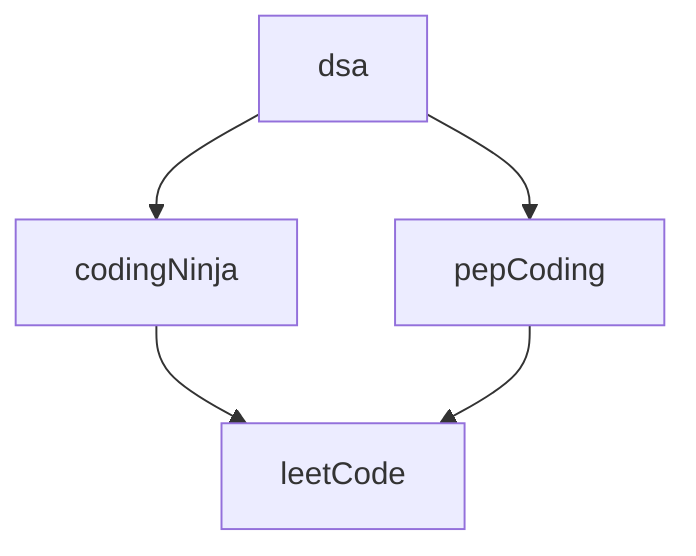

### 105 Day Java From March 2022

# CodingNinja's

CodingNinja's

	

    
  

	
	

#### Problems

  1. <a href="https://raw.githubusercontent.com/DHIMANvivek/105-Days-From-Now/master/returnArraySum.png" class="button primary">Return Array Sum</a> | <a href="https://github.com/DHIMANvivek/105-Days-From-Now/blob/master/Coding_Ninja/src/Return_Array_Sum.java" class="button primary">Sol</a>

# PepCoding

PepCoding

	

    
  

	
	

#### Problems

  1. 

# LeetCode

LeetCode

	

    
  

	
	

#### Problems

  1. <a href="https://leetcode.com/problems/set-matrix-zeroes/" class="button primary">Set Matrix Zeroes</a> | <a href="https://github.com/DHIMANvivek/105-Days-From-Now/blob/master/leetCode/src/leetCode/Set_Matrix_Zeroes.java" class="button primary">Sol</a>

# Content 

		

https://1blockchain.me/Patterns-Java/
 
https://1blockchain.me/Operators-And-For_Loop-Java

	 
	
	 

