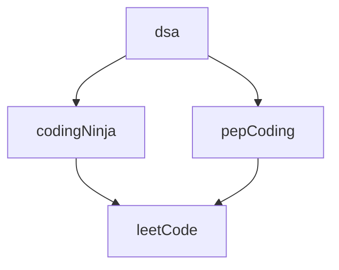

### 105 Day Java From March 2022

# CodingNinja's

CodingNinja's

	

    
  

	
	

#### Problems

  1. <a href="https://raw.githubusercontent.com/DHIMANvivek/105-Days-From-Now/master/returnArraySum.png" class="button primary">Return Array Sum</a> | <a href="https://github.com/DHIMANvivek/105-Days-From-Now/blob/master/Coding_Ninja/src/Return_Array_Sum.java" class="button primary">Sol</a>
  
  2. <a href="https://raw.githubusercontent.com/DHIMANvivek/105-Days-From-Now/master/Coding_Ninja/src/linear%20search.png" class="button primary">Linear Search</a> | <a href="https://github.com/DHIMANvivek/105-Days-From-Now/blob/master/Coding_Ninja/src/linear_Search.java" class="button primary">Sol</a>
	
  3. <a href="https://www.codingninjas.com/codestudio/guided-paths/data-structures-algorithms/content/118820/offering/1381870?leftPanelTab=0" class="button primary">Maximum Subarray Sum [Kadane's Algorithm]</a> | <a href="https://github.com/DHIMANvivek/105-Days-From-Now/blob/master/Coding_Ninja/src/Maximum_Subarray_Sum.java" class="button primary">Sol</a>

  4. <a href="https://raw.githubusercontent.com/DHIMANvivek/105-Days-From-Now/master/Coding_Ninja/src/Arrange_Numbers_In_Arrays.png" class="button primary">Arrange Numbers in Array</a> | <a href="https://github.com/DHIMANvivek/105-Days-From-Now/blob/master/Coding_Ninja/src/Arrange_Numbers_In_Array.java" class="button primary">Sol</a>
	
  5. <a href="https://raw.githubusercontent.com/DHIMANvivek/105-Days-From-Now/master/Coding_Ninja/src/Swap_Alternate.jpg" class="button primary">Swap Alternate</a> | <a href="https://github.com/DHIMANvivek/105-Days-From-Now/blob/master/Coding_Ninja/src/Swap_Alternate.java" class="button primary">Sol</a>
 

# PepCoding

PepCoding

	

    
  

	
	

#### Problems

  1.  <a href="https://www.pepcoding.com/resources/online-java-foundation/patterns/pattern-type-1-official/ojquestion" class="button primary">Pattern 1</a> | <a href="https://github.com/DHIMANvivek/105-Days-From-Now/blob/master/pepCoding/Pattern1.java" class="button primary">Sol</a>
	
  2.  <a href="https://www.pepcoding.com/resources/online-java-foundation/patterns/pattern-type-2-official/ojquestion" class="button primary">Pattern 2</a> | <a href="https://github.com/DHIMANvivek/105-Days-From-Now/blob/master/pepCoding/pattern2.java" class="button primary">Sol</a>
	
  3.  <a href="https://www.pepcoding.com/resources/online-java-foundation/patterns/pattern-type-3-official/ojquestion" class="button primary">Pattern 3</a> | <a href="https://github.com/DHIMANvivek/105-Days-From-Now/blob/master/pepCoding/pattern3.java" class="button primary">Sol</a>
	
  4.  <a href="https://www.pepcoding.com/resources/online-java-foundation/function-and-arrays/digit-frequency-official/ojquestion" class="button primary">Digit Frequency</a> | <a href="https://github.com/DHIMANvivek/105-Days-From-Now/blob/master/pepCoding/Digit_Frequency.java" class="button primary">Sol</a>
	
	
	

# LeetCode

LeetCode

	

    
  

	
	

#### Problems

  1. <a href="https://leetcode.com/problems/set-matrix-zeroes/" class="button primary">Set Matrix Zeroes</a> | <a href="https://github.com/DHIMANvivek/105-Days-From-Now/blob/master/leetCode/src/leetCode/Set_Matrix_Zeroes.java" class="button primary">Sol</a>
	
	
  2. <a href="https://leetcode.com/problems/pascals-triangle/submissions/" class="button primary">Pascal's Triangle</a> | <a href="https://github.com/DHIMANvivek/105-Days-From-Now/blob/master/leetCode/src/leetCode/pascal_Triangle.java" class="button primary">Sol</a> | <a href="https://www.youtube.com/watch?v=icoql2WKmbA" class="button primary">Video</a> | ★
	

# Content 

		

https://1blockchain.me/Patterns-Java/
 
https://1blockchain.me/Operators-And-For_Loop-Java

	 
	
	 

